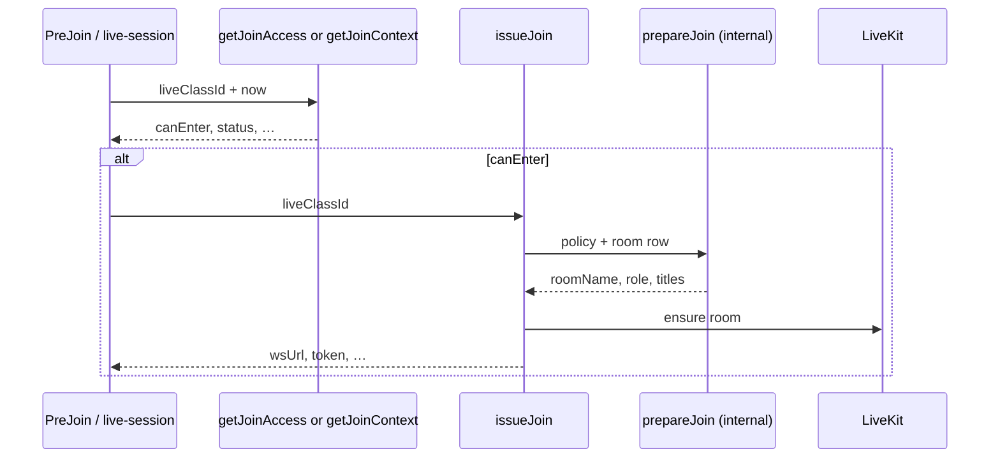

# Live join API — Convex contract

**Audience:** `live-session` agent (Approach A), frontend join flow  
**Related:** [`APPROACH_A_IMPLEMENTATION.md`](./APPROACH_A_IMPLEMENTATION.md), [`CONVEX-LIVE-REFACTOR.md`](./CONVEX-LIVE-REFACTOR.md), [`live-join-flow.md`](./live-join-flow.md)  
**Validators:** `convex/live/joinContract.ts`

---

## Overview

Joining a live class uses **two public Convex calls** (unchanged):

1. **Query** — pre-flight gate (window, reservation, equipment, `canEnter`)
2. **Action** — mint LiveKit JWT after server policy (`prepareJoin`)



**Clock rule:** queries take `now: number` (ms). Pass `useQueryNowMs().nowMs` — never `Date.now()` inside query handlers.

---

## `api.live.class.getJoinAccess` (query)

Pre-flight before `issueJoin`. Returns `null` when the viewer cannot see the class (unsigned in, no reservation, no member profile).

### Args

| Field | Validator | Notes |
|--------|-----------|--------|
| `liveClassId` | `v.id("liveClasses")` | Route `?classId=` |
| `now` | `v.number()` | Client clock; required |

### Returns (`JoinAccessSnapshot \| null`)

| Field | Type | Meaning |
|--------|------|---------|
| `joinOpensAt` | `number` | Unix ms — window open |
| `joinClosesAt` | `number` | Unix ms — window close |
| `startsAt` | `number` | Class start |
| `status` | `"draft" \| "scheduled" \| "live" \| "ended" \| "cancelled"` | Class lifecycle |
| `canEnter` | `boolean` | `true` → safe to call `issueJoin` (still re-validated server-side) |
| `minutesUntilOpen` | `number \| null` | Countdown when before window; `null` if open |
| `minutesUntilClose` | `number \| null` | Countdown until window ends; `null` if past close |
| `isInstructor` | `boolean` | Viewer is instructor or admin for this class |
| `equipmentBlocked` | `boolean` | Member lacks required equipment (`canEnter` is `false`) |

### `canEnter` logic

All must hold:

- `now` inside `[joinOpensAt, joinClosesAt]`
- `status` not `ended`, `cancelled`, or `draft`
- Instructor/admin **or** `status === "live"` (customers wait until class is live)

### Callers (do not remove)

| Module | Usage |
|--------|--------|
| `src/lib/features/live/join-token.ts` | `fetchJoinToken` before `issueJoin` |
| `src/lib/features/live/livekit-connection.svelte.ts` | `fetchJoinAccessSnapshot` on disconnect / ended check |

---

## `api.live.session.getJoinContext` (query) — **new**

Same gate as `getJoinAccess`, plus **`classTitle`** for PreJoin / waiting UI **without** calling `issueJoin`.

Use when Approach A subscribes reactively (`useQuery` + `useQueryNowMs`) and defers the action until the user clicks connect.

### Args

Same as `getJoinAccess`.

### Returns (`JoinContext \| null`)

All `JoinAccessSnapshot` fields, plus:

| Field | Type |
|--------|------|
| `classTitle` | `string` |

`null` cases match `getJoinAccess`.

### When to use which

| Need | Endpoint |
|------|----------|
| Legacy `fetchJoinToken` one-shot | `getJoinAccess` (unchanged) |
| Reactive PreJoin title + waiting state | `getJoinContext` |
| LiveKit JWT + `instructorName` | `issueJoin` only |

`issueJoin` still returns `classTitle` and `instructorName` for the connected session header.

---

## `api.livekit.token.issueJoin` (action)

Mints LiveKit JWT. **Requires Convex Auth.** Runs `internal.live.room.prepareJoin` then `ensureLiveKitRoom`.

### Args

| Field | Type |
|--------|------|
| `liveClassId` | `Id<"liveClasses">` |

No `now` arg — policy uses `Date.now()` inside the internal mutation (not a cached query).

### Returns (`IssueJoinResult`) — **stable**

| Field | Type | Client usage |
|--------|------|----------------|
| `wsUrl` | `string` | `Room.connect(wsUrl, token)` |
| `token` | `string` | JWT; refresh ~7 min before TTL (`TTL.JOIN_TOKEN` = 10m server) |
| `roomName` | `string` | `homebody_liveClass_{id}` |
| `liveClassId` | `Id<"liveClasses">` | Guard: `assertIssueJoinMatchesClass` |
| `participantRole` | `"instructor" \| "customer" \| "admin"` | Publish UI; privileged = instructor or admin |
| `joinClosesAt` | `number` | Expiry modal / reconnect guard |
| `classTitle` | `string` | Header |
| `instructorName` | `string` | Header subtitle |
| `liveClassType` | `"group_live" \| "one_on_one"` | Layout hints |

Validator: `issueJoinResultValidator` in `joinContract.ts`.

### Errors (thrown)

From `prepareJoin` / `joinPolicy.ts` — map in UI:

| Message (typical) | Cause |
|-------------------|--------|
| `Authentication required` | No Convex identity |
| `השיעור לא נמצא` | Bad id |
| `ההצטרפות תיפתח …` / `חלון ההצטרפות נסגר` | Outside join window |
| `השיעור אינו חי` | Customer before `status === "live"` |
| `נדרשת הרשמה מראש` | No reservation |
| `חסר ציוד נדרש` | Equipment (also surfaced via `equipmentBlocked` on query) |
| `נדרש פרופיל אישי` / `נדרש פרופיל משתמש` | Profile missing |

### Token refresh

Call `issueJoin` again with the same `liveClassId`. Idempotent for instructors; customers may move `reserved` → `joined` via webhook on first connect.

---

## Internal: `internal.live.room.prepareJoin`

Not browser-callable. Invoked only from `issueJoin`.

Responsibilities: auth, role, customer reservation/credits, `liveRooms` row, `liveJoinEvents` audit.

Returns `PrepareJoinResult` (includes server-only `userId`, `capacity`, `maxParticipants`, etc.). See `prepareJoinResultValidator`.

---

## Shared resolver

`resolveJoinAccess` in `convex/live/joinAccess.ts` backs both queries so policy stays in one place.

---

## Approach A — `live-session` migration

### Recommended split

```ts
// Reactive (60s tick or visibility refresh)
useQuery(api.live.session.getJoinContext, () =>
  liveClassId ? { liveClassId, now: queryNow.nowMs } : "skip",
);

// On user connect / refresh only
await client.action(api.livekit.token.issueJoin, { liveClassId });
```

### Status mapping (from `join-token.ts`)

| Condition | `RoomStatus` |
|-----------|----------------|
| `equipmentBlocked` | `equipment` |
| `!canEnter` && `minutesUntilOpen !== null` | `waiting` |
| `!canEnter` && ended/cancelled | `error` (ended copy) |
| `canEnter` + instructor + `scheduled` | `prep` (after token) |
| `canEnter` + token ok | `ready` |

### Do not

- Call `issueJoin` on every `now` tick — action only on connect/refresh.
- Remove `getJoinAccess` — still used by `fetchJoinToken` and disconnect polling.
- Add client-side mutations for join; keep policy on Convex.

### Env (actions)

`LIVEKIT_API_KEY`, `LIVEKIT_API_SECRET`, `LIVEKIT_URL` or `LIVEKIT_WS_URL` — `convex/lib/livekitEnv.ts`.

---

## File map

| File | Role |
|------|------|
| `convex/live/class.ts` | `getJoinAccess` |
| `convex/live/session.ts` | `getJoinContext` |
| `convex/live/joinAccess.ts` | `resolveJoinAccess` |
| `convex/live/joinContract.ts` | Validators + TS types |
| `convex/livekit/token.ts` | `issueJoin` |
| `convex/live/room.ts` | `prepareJoin` |
| `convex/live/joinPolicy.ts` | Role + eligibility |
