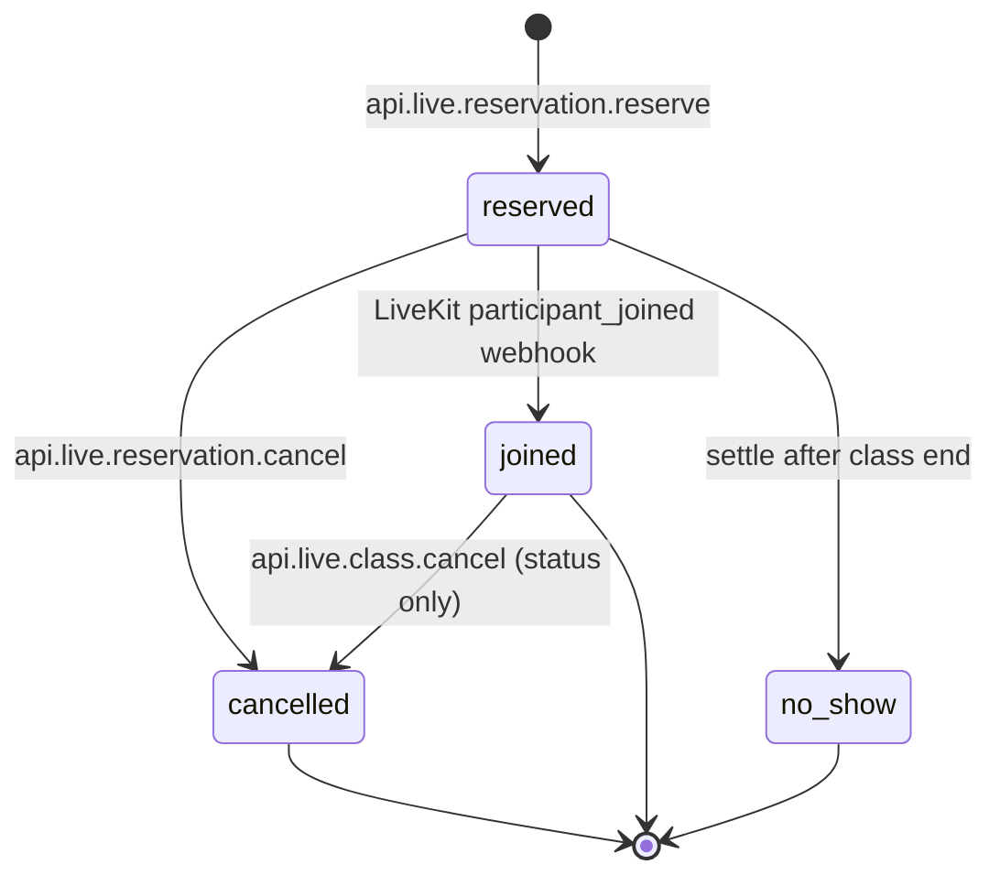

# Live reservations lifecycle

This document maps **reservation state**, **join gates**, **reminders**, and **settlement** for live classes. Wallet math (`reserveCredits`, `consumeCredits`, `releaseCredits`) lives in `convex/credits/**` — coordinate with the credits owner for balance bugs.

## Tables (schema)

| Table | Role |
|-------|------|
| `liveClasses` | Schedule, join window, capacity, status |
| `liveReservations` | Per-member hold: credits reserved until join or cancel/settle |
| `liveRooms` | LiveKit room; `active` + `startedByUserId` = broadcast live |
| `liveAttendance` | Webhook-tracked presence sessions |
| `liveJoinEvents` | Audit log for token/webhook join attempts |
| `liveReminderEvents` | Scheduled push/email (`day_before`, `thirty_minutes`) |

### Reservation statuses

| Status | Meaning |
|--------|---------|
| `reserved` | Seat held; credits in wallet **reserved** bucket |
| `joined` | Member entered room; credits **consumed** (webhook on first join) |
| `cancelled` | User or instructor cancelled; reserved credits **released** |
| `no_show` | Class ended while still `reserved`; credits **released** via settle |
| `refunded` | Schema only — **not written anywhere yet**; credits agent should implement class-cancel refunds for `joined` |

## Lifecycle diagram

## Reserve (`api.live.reservation.reserve`)

1. Auth + rate limit + equipment check.
2. Class must be `scheduled` or `live`; `now <= joinClosesAt`.
3. No overlapping `reserved`/`joined` reservation for another class.
4. `reserveCredits` + `reserveClassSeat` + insert/patch reservation.
5. `createReminderEventsForReservation` schedules `liveReminderEvents`.

## Join window & access

- Window: `[joinOpensAt, joinClosesAt]` (`convex/lib/liveJoin.ts`).
- **Customers** need: valid reservation, equipment, class `live`, **active room broadcast** (`liveRooms.status === "active"` and `startedByUserId` set).
- **Instructors/admins** may enter when in window even before broadcast (`resolveJoinAccess`, `prepareJoin`).

Queries:

- `api.live.session.getJoinContext` / `api.live.class.getJoinAccess` — pre-flight UI (`now` arg, no `Date.now()` in query body).
- `internal.live.room.prepareJoin` — token prep (mutation).
- `api.livekit.token.issueJoin` — JWT (action).

First customer join (webhook `participant_joined` in `convex/livekitAttendance/events.ts`):

1. Policy checks (reservation, window, role).
2. `consumeCredits` + patch reservation → `joined`.
3. Insert `liveAttendance` if no open session.

Re-join: reservation already `joined`; credits not consumed again.

## Instructor go-live

`api.live.class.start` → class `live`, `ensureLiveRoomForClass` with `startedByUserId`. Until then, calendar join button stays hidden (aligned with `viewerCanJoin` + `canEnter`).

## End paths

| Trigger | Class | Reserved seats | Joined seats | Reminders |
|---------|-------|----------------|--------------|-----------|
| User cancel | — | `releaseCredits`, `cancelled` | — | pending → `cancelled` |
| Instructor `class.cancel` | `cancelled` | release + `cancelled` | `cancelled` (no wallet release) | pending → `cancelled` |
| Instructor `class.end` / cron `endOne` | `ended` | settle → `no_show` + release | unchanged | skip if ended |
| `settle` / cron | — | `no_show` + release + seats | — | — |

**Credits gap:** Cancelling a class while members are `joined` marks `cancelled` but does not refund consumed credits. Implement `refunded` + wallet credit in `convex/credits/**`.

## Reminders

1. **Create** (`liveReminders/create.ts`): day-before + 30m before `startsAt` if `sendAt > now`.
2. **Schedule** (`liveReminders/schedule.ts`): `internal.liveReminders.process.one` at `sendAt`.
3. **Due sweep** (`liveReminders/process.due`): backup for missed scheduler runs.
4. **Deliver** (`liveReminders/deliver.one`): push + email via prefs; `finalize` → `sent` / `skipped`.

Skip delivery when (`shouldSkipLiveReminderDelivery`):

- Reservation `cancelled` / `refunded` / `no_show`
- Class `cancelled` / `ended`

Reschedule (`class.reschedule`): recomputes `sendAt` for pending reminders; past times → `skipped`.

## Edge cases

| Case | Behavior |
|------|----------|
| Class cancelled after reserve | Instructor cancel releases reserved credits; reminders cancelled |
| Instructor reschedule | Pending reminders rescheduled or skipped if in the past |
| Staff vs customer join | Instructor/admin bypass reservation; customers need reserve + broadcast |
| Expired reservation | After class end, `settle` → `no_show`, credits released |
| Join before window | `assertInLiveJoinWindow` denies |
| Double join | Webhook avoids duplicate open `liveAttendance`; rejoin allowed |
| Calendar join before broadcast | Fixed: `viewerCanJoin` requires `broadcastLive` unless instructor |
| Dashboard live banner | Uses `reserved` **or** `joined` active reservations for live classes |

## Frontend data sources

| UI | Convex source |
|----|----------------|
| Calendar cards | `api.live.calendar.listRange` — title/times from `liveClass` doc |
| Join room | `api.live.session.getJoinContext` + `api.livekit.token.issueJoin` |
| LiveAlert | `api.users.dashboard.get` → `liveAlert.title` from class doc |
| Next live sidebar | `api.live.next.get` |

Do not invent class titles or times client-side.

## Key files

- `convex/live/reservation.ts` — reserve / cancel
- `convex/live/class.ts` — CRUD, start/end/cancel/reschedule
- `convex/live/joinAccess.ts` — shared join gate
- `convex/live/joinPolicy.ts` — mutation-side policy
- `convex/live/settle.ts` — no-show settlement
- `convex/live/cron.ts` — auto end at `joinClosesAt`
- `convex/liveReminders/*` — reminder pipeline
- `convex/livekitAttendance/events.ts` — join → `joined` + consume

## Tests

- `convex/lib/liveReminderDelivery.test.ts` — reminder skip rules

Run: `bun test convex/lib/liveReminderDelivery.test.ts`
