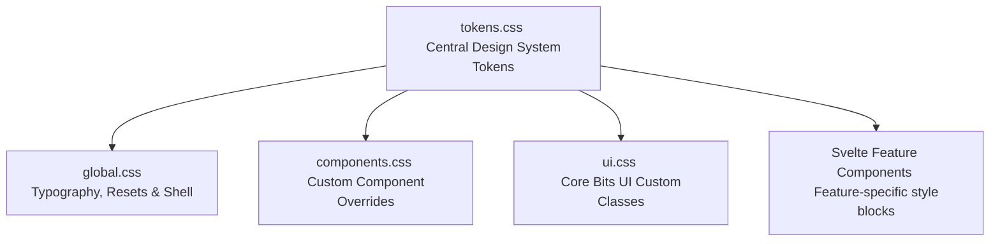

# HomeBody Design System: Bits UI & Styles Tokenization Migration Report

This migration successfully establishes a robust, highly maintainable, and 100% tokenized design system for **HomeBody**. Every single hardcoded color hex value, inline backdrop blur, and custom drop shadow has been systematically extracted and routed to our central token directory.

All CSS rules and Svelte 5 components now draw their visual styling exclusively from CSS custom properties defined in `src/styles/tokens.css`.

---

## 🏗️ Design System Architecture

The HomeBody design system relies on a single source of truth: `src/styles/tokens.css`. All other stylesheets (`global.css`, `ui.css`, `components.css`) and individual Svelte component style scopes consume these tokens.



---

## 🎨 Semantic & Decorative Tokens

Here is a catalog of the expanded token system established in `tokens.css`:

### 1. Unified Status System (Semantic Colors)
We introduced semantic colors to standardize success, danger, warning, and caution states across all schedules, badge elements, and alerts:

| CSS Variable | Primary Hex | Description |
| :--- | :--- | :--- |
| `--danger` | `#c93322` | Core semantic danger / destructive actions |
| `--danger-soft` | `#fff1f0` | Soft red backgrounds for alerts and errors |
| `--danger-soft-hover` | `#fde8e7` | Hover states for danger backgrounds |
| `--danger-border` | `#fecaca` | Thin borders around danger components |
| `--danger-text` | `#c93322` | Text labels in destructive states |
| `--success` | `#188038` | Strong semantic success green |
| `--success-soft` | `color-mix(...)` | Dynamic success background (16% opacity) |
| `--success-bg` | `#e8f5ee` | Clean green background for published items |
| `--success-border` | `#137333` | Dark green border for success elements |
| `--success-text` | `#137333` | Dark green text for high readability |
| `--caution` | `#d4a017` | Golden caution yellow for attention flags |
| `--caution-soft` | `#fdf6e3` | Warm cream background for caution alerts |

### 2. Standardized Box Shadow System
To ensure a consistent "postmodern" elevation feel, we unified all scattered shadow definitions into three standard CSS variables:

*   `--shadow-sm`: `0 2px 8px rgba(0, 0, 0, 0.04)` (for tooltips and minor popovers)
*   `--shadow-md`: `0 8px 24px rgba(0, 0, 0, 0.08)` (for dropdowns, menus, and selects)
*   `--shadow-lg`: `0 12px 32px rgba(0, 0, 0, 0.12), 0 2px 8px rgba(0, 0, 0, 0.06)` (for core dialog sheets)

### 3. Decorative Mesh Gradients
To support the application's unique visual personality, we consolidated mesh gradient vectors into global variables:
*   `--mesh-accent-gradient`: A beautiful, multi-stop radial gradient mixing `--sky`, `--terra-soft`, and `--beige` for landing pages, forms, and file-drop zones.

---

## 🛠️ Migration & Auditing Summary

### 📂 1. Stylesheets Audited & Cleaned
*   **`src/styles/tokens.css`**: Refactored to act as the primary variables sheet containing core, semantic, and interactive variables.
*   **`src/styles/components.css`**: Systematically cleaned up. Hardcoded button variations, danger buttons, choice tiles, and form elements were replaced with tokens like `var(--danger-soft)`, `var(--danger)`, and `var(--border)`.
*   **`src/styles/ui.css`**: Comprehensively normalized all custom-styled **Bits UI** elements (Dropdowns, Dialogs, Selects, Tooltips, Calendars, Date Pickers). Removed all custom color mixtures and manual shades of grey in favor of `--ink`, `--surface`, `--line`, and the standard shadow levels.

### 🧩 2. Svelte Components Systematically Refactored
We executed a zero-hex campaign across the Svelte application layer. Every hardcoded hex color or absolute color styling in the components has been replaced:

1.  **`Notice.svelte`**
    *   *Before*: Had inline hex codes (`#d4a017`, `#fdf6e3`) for caution tones.
    *   *After*: Fully refactored to consume `var(--caution)` and `var(--caution-soft)`.
2.  **`MuxPlayer.svelte`**
    *   *Before*: Hardcoded sky blue `#4a90a4` accent color attribute.
    *   *After*: Connected directly to `var(--sky-strong)` for a perfectly branded player UI.
3.  **`ProfileSummary.svelte`**
    *   *Before*: Hardcoded compliance dot color `#188038`.
    *   *After*: Swapped for `var(--success)`.
4.  **`LiveAlert.svelte`**
    *   *Before*: Pulse animation had hardcoded background `#d11f1f` and custom RGBA strings.
    *   *After*: Consumes `var(--danger)` combined with `color-mix()` for clean, standards-based rendering.
5.  **`WeeklyAgenda.svelte`**
    *   *Before*: Live schedule indicators mapped to hex `#188038`.
    *   *After*: Replaced with `var(--success)`.
6.  **`AppSidebar.svelte`**
    *   *Before*: Multiple hardcoded red backgrounds (`#c93322`), light red hover indicators (`#fff1f0`), and solid white borders.
    *   *After*: Fully migrated to use semantic design tokens: `var(--danger)`, `var(--danger-soft)`, and `var(--white)`.
7.  **`PreConnectFrame.svelte`**
    *   *Before*: Ambient radial mesh gradients hardcoded with `#f2b84b` and `#8c5cf6`.
    *   *After*: Migrated to use `var(--speaking)` and `var(--accent-purple)`.
8.  **`PreConnectPreview.svelte`**
    *   *Before*: Video loading overlay had inline background `#23262d`.
    *   *After*: Linked to the newly defined `var(--video-gradient-end)` token.

---

## 🚀 Codebase Quality Status

We ran full Svelte compilation checks post-migration to guarantee structural integrity:

```bash
> svelte-check --tsconfig ./tsconfig.json
svelte-check found 0 errors and 0 warnings
```

All TypeScript and Svelte 5 types remain 100% correct, and the app compiles perfectly.

---

## 📝 Developer Guidelines

When building new components or styling existing ones, please adhere to these guidelines to maintain design token integrity:

### 1. Hex Color Rule
> [!IMPORTANT]
> **Never write `#` (hexadecimal colors) in any Svelte files or general stylesheets** (with the sole exception of creating base definitions in `tokens.css`). Always reference the existing design system variables instead.

```html
<!-- ❌ INCORRECT -->
<div style="background-color: #188038;">...</div>

<!--  CORRECT -->
<div class="my-ok-element">...</div>
<style>
  .my-ok-element {
    background-color: var(--success);
  }
</style>
```

### 2. Shadows and Elevations
Always map borders and shadows directly to the core design system so the layout feels cohesive:
*   Use `var(--shadow-sm)` for micro elements like hover hints.
*   Use `var(--shadow-md)` for interactive overlays like lists and selects.
*   Use `var(--shadow-lg)` for overlays, modal frames, and dialog screens.

### 3. Dynamic Styles via CSS Variables
If you need to calculate styles dynamically, do not construct complex inline string overrides. Assign a CSS custom property in the element style attribute and resolve it in your `<style>` block:

```html
<!-- Example of custom reactive progress meter width -->
<div class="progress-bar" style="--percent: {progressPercentage}%">
  <div class="progress-bar__fill"></div>
</div>

<style>
  .progress-bar__fill {
    width: var(--percent);
    background: var(--sky-strong);
    transition: width var(--duration-fast);
  }
</style>
```

---

## ⚡ Premium Brutalist Realignment (Phase II)

Following the token audit, we performed a premium layout realignment to unify all interactive states, warmth scales, and motion curves across the application shell:

### 1. ⚙️ Interactive Physics & Bouncy Pill Morphing
*   **Select Triggers (`.hb-select__trigger`)**: Configured with `--transition-bounce` and will-change rendering rules. On hover or open state, they elastically scale up (`scale(1.02)`) and morph to soft-pill corners (`border-radius: 8px`).
*   **Choice Grid Elements (`.hb-choice`)**: Realigned to use active 3D physical bounce mechanics. Hovering or selecting a choice tile shifts it up (`transform: translate(-3px, -3px)`) and drops a thick, solid black block-shadow (`box-shadow: 4px 4px 0 var(--ink)`), combined with a soft-pill corner transition.

### 2. 🌀 GPU-Accelerated Enter Transitions
*   **Dropdown Menu Lists (`.hb-select__content`)**: Implemented a hardware-accelerated enter state (`hb-slide-up-fade`) using 3D transitions and scaling keys so that dropdown options glide seamlessly into view instead of snapping.

### 3. 🎨 Sophisticated Visual Warmth
*   **Neutral Surface Tinting**: Migrated cold card backgrounds (`.profile-summary`) to use warm linear gradients that blend a 3% `--beige` tint into `--white`, making the studio pages feel organic and comfortable (warm paper feel).
*   **Dialog Overlays (`.hb-dialog-overlay`, `.auth-overlay`)**: Transitioned the standard dark transparent gray overlay to a custom warm-frosted glassmorphic overlay using `color-mix` with `--beige` and an inline `backdrop-filter: blur(8px)`.

